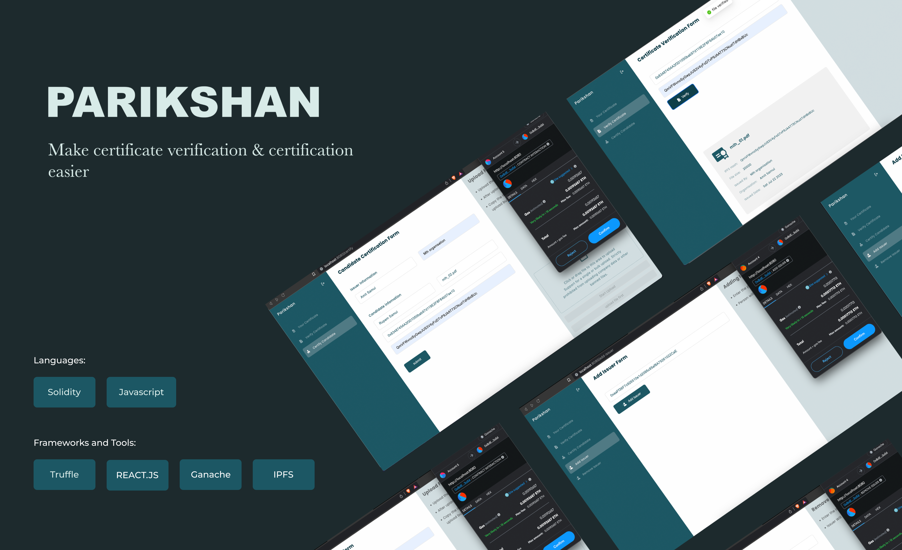
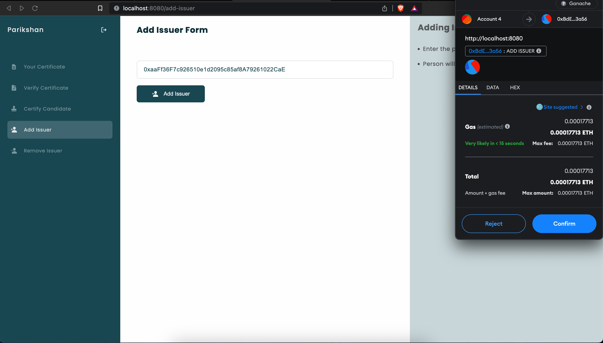
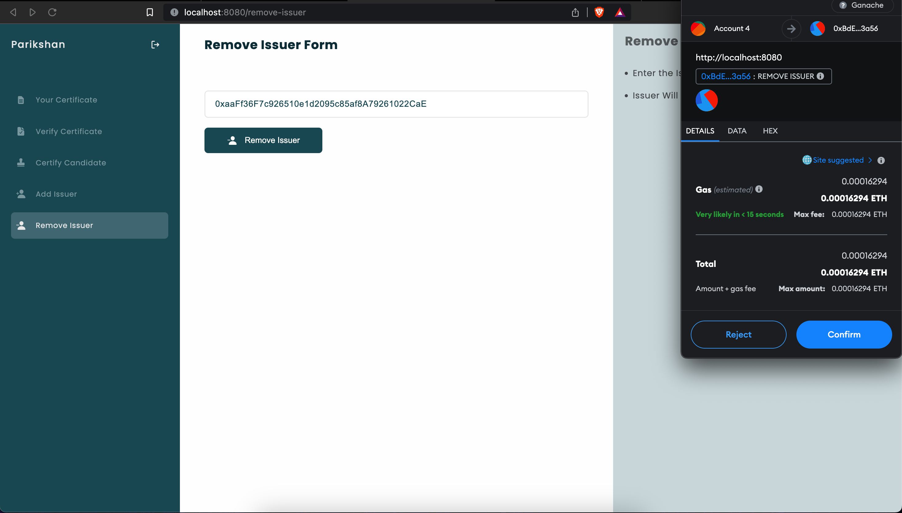
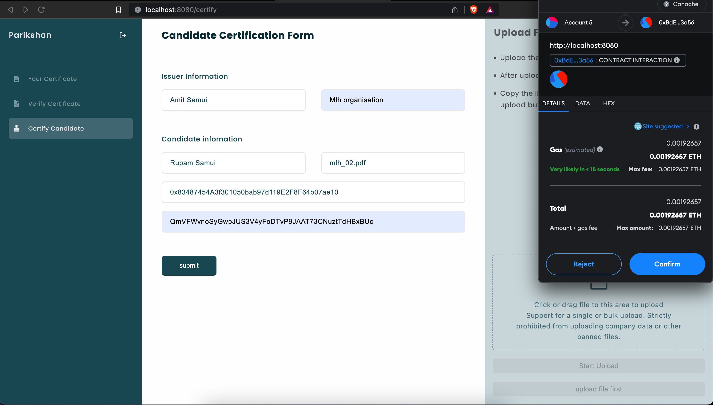
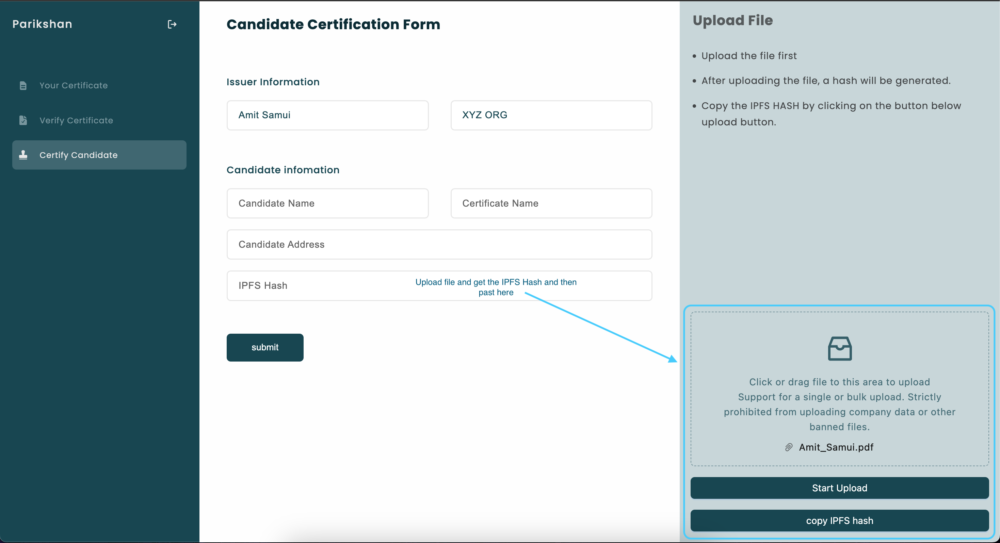
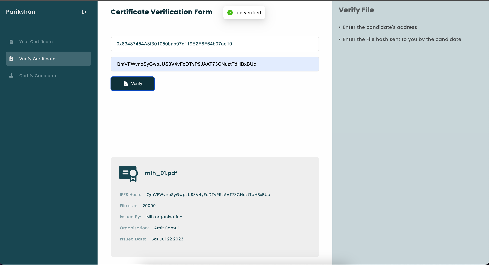
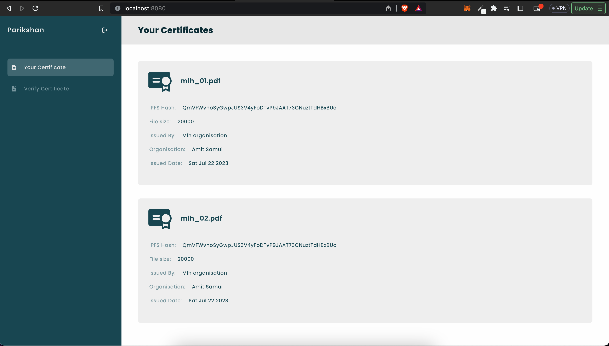

# PARIKSHAN

**Parikshan** is a decentralized application (DApp) built on the blockchain that enables secure and transparent verification of certificates and credentials. The system leverages **blockchain technology** and **IPFS (InterPlanetary File System)** to ensure the integrity and immutability of certificate records.

## Features

### 1. Add Issuer

-   Description: Allows administrators to add new issuers or certificate authorities to the system.
-   Usage: Administrators can use this feature to onboard trusted issuers who have the authority to certify candidates and issue certificates.

### 2. Remove Issuer

-   Description: Provides the capability to remove an issuer from the system if they are no longer authorized to issue certificates.
-   Usage: Administrators can utilize this feature to revoke the certification privileges of an issuer to maintain the credibility of the system.

### 3. Certify Candidate

-   Description: Enables authorized issuers to certify candidates and issue unique certificates to successful candidates.
-   Usage: Authorized issuers can use this feature to certify the candidates who have completed specific courses, exams, or qualifications.

### 4. Upload File to IPFS

-   Description: Allows issuers to securely upload certificate files to IPFS, a decentralised and distributed file storage system.
-   Usage: Issuer can upload candidate's digital certificate files to IPFS, ensuring the certificates are securely stored and immutable.

### 5. Verify File

-   Description: Provides a certificate verification mechanism that allows third parties to verify the authenticity of uploaded certificate files.
-   Usage: Third-party verifiers, such as employers or educational institutions, can use this feature to validate the integrity and legitimacy of certificates.

### 6. Your certificates

## How to Use

Clone the Repository: `git clone https://github.com/AmitSamui/parikshan.git`
There will be two separate folders infront of you **📁client** and **📁truffle**

### Truffle and IPFS (Inter Planetary File System)
1.  Configure Blockchain and IPFS: Set up the appropriate configurations for your chosen blockchain platform and IPFS node.
2. For IPFS configuration , go to [Infura website](https://app.infura.io/) , create an account and generate the IPFS **project api key** and **api secret key** and save them for later.
3.  Deploy Smart Contracts: Deploy the smart contracts to the blockchain network using `Truffle migrate` after doing necessary configuration in **📁truffle-config.js**.

### Client
1.  Install Dependencies: `npm install`.
2. Add environment variables and add below variables:

        REACT_APP_IPFS_API_KEY= your api key
        REACT_APP_IPFS_API_SECRET_KEY=your secret key
3. run `npm start`

## 
Copyright (c) 2023 Parikshan